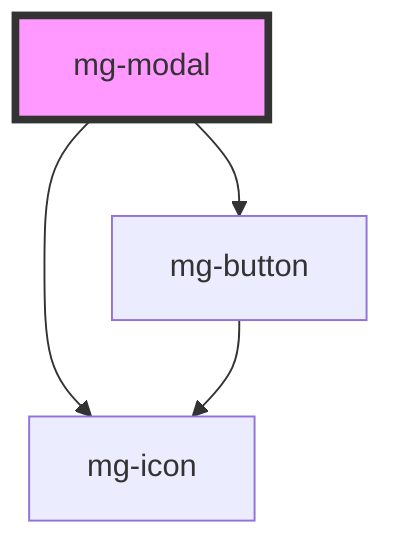

## Design

**RG-01** : Une modale possède :

- une croix en haut à droite
- un titre
- un corps composé de champs ou d'un message
- un bouton de validation
- un bouton d'annulation

**RG-02** : Au clic sur la croix, la fenêtre se ferme et aucun traitement n'est effectué.

**RG-03** : Au clic sur le bouton d'annulation ou lors de l'appui de la touche `<Echap>`, la fenêtre se ferme et aucun traitement n'est effectué.

**RG-04** : Au clic sur le bouton de validation, le traitement est effectué et la fenêtre se ferme.

**RG-05** : Tant que l'utilisateur n'utilise pas sur un de ces 3 boutons, la modale ne se ferme pas.

**RG-06** : La modale permet de focaliser l'attention sur ce qu'elle demande : une confirmation ou une annulation.
En ce sens le reste de l'écran ne doit pas être accessible :

- il est masqué par un backdrop.
- le clic sur le backdrop ne ferme pas la fenêtre

**RG-01** : Le titre de la fenêtre est écrit avec un nom
Ex : Ajout de la valeur

**RG-02** : Le libellé du bouton de validation est le verbe à l'infinitif de l'action en cours.
Eviter le verbe "Valider" si un plus explicite est possible
Ex : "Ajouter" pour l'ajout d'une valeur
"Supprimer" pour la suppression d'une valeur
"Modifier" pour la modification d'une valeur

**RG-03** : Icone ou pas icone sur les boutons d'action ?
Dans le cas d'une action ciblée, l'ico peut aider à la compréhension voir même rassurer > icone check qui valide l'action.
Dans le cas d'un choix de confirmation/annulation : pas nécessaire voire superflu > le terme suffit "Enregistrer/Annuler",
Ex : si je mets un check devant le terme "Supprimer" qui est le bouton de validation d'une suppression, le check renvoie à du positif alors que l'action de suppression est négative, et le bouton Annuler également, donc pour ne pas ajouter à la confusion ne pas mettre d'icone...

### Formes

### Fonts

### Espacements
### Espacements entre les bords et le contenu

### Espacements entre le titre, le texte et les boutons

### Espacements entre le titre et le bouton croix

### Alignements

### Tailles

### Couleurs

### Backdrop

- Couleur : noir
- Intensité : 5
- Luminosité : 3

<!-- Auto Generated Below -->

## Properties

| Property                  | Attribute      | Description                                                                                                 | Type      | Default                |
| ------------------------- | -------------- | ----------------------------------------------------------------------------------------------------------- | --------- | ---------------------- |
| `closeButton`             | `close-button` | Define if modal has a cross button                                                                          | `boolean` | `false`                |
| `hide`                    | `hide`         | Define if modal is hidden                                                                                   | `boolean` | `false`                |
| `identifier`              | `identifier`   | Identifier is used for the element ID (id is a reserved prop in Stencil.js) If not set, it will be created. | `string`  | `createID('mg-modal')` |
| `modalTitle` _(required)_ | `modal-title`  | Displayed modal title required                                                                              | `string`  | `undefined`            |

## Events

| Event            | Description                          | Type                  |
| ---------------- | ------------------------------------ | --------------------- |
| `component-hide` | Emmited event when modal is hidden   | `CustomEvent<string>` |
| `component-show` | Emmited event when modal is diplayed | `CustomEvent<string>` |

## Dependencies

### Depends on

- [mg-button](../../atoms/mg-button)
- [mg-icon](../../atoms/mg-icon)

### Graph

----------------------------------------------

*Built with [StencilJS](https://stenciljs.com/)*
