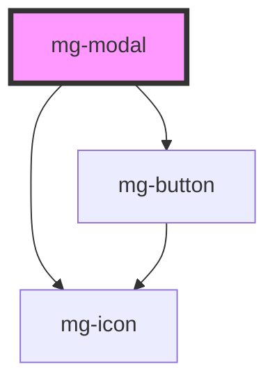

## Anatomy

A modal has :

- a closing cross at the top right corner
- a title
- a body composed of fields or a message
- a validation button
- a cancel button

## Behavior

When clicking on the cross, the window closes and no processing is done.

When the cancel button is clicked or when the `<Escape>` key is pressed, the window closes and no processing is done.

When the validation button is clicked, processing is performed and the window closes.

As long as the user does not press one of these three buttons, the modal does not close.

The modal allows to focus the attention on what it asks: a confirmation or a cancellation.
In this sense the rest of the screen should not be accessible:

- it is hidden by a backdrop.
- clicking on the backdrop does not close the window

The title of the window is written with a name
Ex : Add value

The wording of the validation button is the infinitive verb of the current action.
Avoid the verb "Validate" if a more explicit one is possible.
Ex : "Add" for adding a value
"Delete" to delete a value
"Modify" to modify a value

Icon or not icon on the action buttons ?
In the case of a targeted action, the ico can help to understand or even reassure > check icon that validates the action.
In the case of a confirmation/cancellation choice: not necessary or even superfluous > the term "Save/Cancel" is enough,
Ex: if I put a check in front of the term "Delete" which is the validation button of a deletion, the check refers to positive while the action of deletion is negative, and the Cancel button also, so not to add to the confusion not to put an icon ...

## Specs

### Formes

### Fonts

### Espacements

### Espacements entre les bords et le contenu

### Espacements entre le titre, le texte et les boutons

### Espacements entre le titre et le bouton croix

### Alignements

### Tailles

### Couleurs

### Backdrop

- Color : black
- Intensity: 5
- Brightness : 3

<!-- Auto Generated Below -->

## Properties

| Property                  | Attribute      | Description                                                                                                 | Type      | Default                |
| ------------------------- | -------------- | ----------------------------------------------------------------------------------------------------------- | --------- | ---------------------- |
| `closeButton`             | `close-button` | Define if modal has a cross button                                                                          | `boolean` | `false`                |
| `hide`                    | `hide`         | Define if modal is hidden                                                                                   | `boolean` | `false`                |
| `identifier`              | `identifier`   | Identifier is used for the element ID (id is a reserved prop in Stencil.js) If not set, it will be created. | `string`  | `createID('mg-modal')` |
| `modalTitle` _(required)_ | `modal-title`  | Displayed modal title required                                                                              | `string`  | `undefined`            |

## Events

| Event            | Description                          | Type                  |
| ---------------- | ------------------------------------ | --------------------- |
| `component-hide` | Emmited event when modal is hidden   | `CustomEvent<string>` |
| `component-show` | Emmited event when modal is diplayed | `CustomEvent<string>` |

## Dependencies

### Depends on

- [mg-button](../../atoms/mg-button)
- [mg-icon](../../atoms/mg-icon)

### Graph

----------------------------------------------

*Built with [StencilJS](https://stenciljs.com/)*
