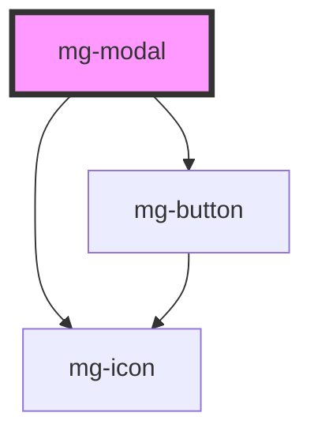

This molecule refers to the [PDA9-63](https://jira.mgdis.fr/browse/PDA9-63).

<!-- Auto Generated Below -->

## Properties

| Property                  | Attribute      | Description                                                                                                 | Type      | Default                |
| ------------------------- | -------------- | ----------------------------------------------------------------------------------------------------------- | --------- | ---------------------- |
| `closeButton`             | `close-button` | Define if modal has a cross button                                                                          | `boolean` | `false`                |
| `hide`                    | `hide`         | Define if modal is hidden                                                                                   | `boolean` | `false`                |
| `identifier`              | `identifier`   | Identifier is used for the element ID (id is a reserved prop in Stencil.js) If not set, it will be created. | `string`  | `createID('mg-modal')` |
| `modalTitle` _(required)_ | `modal-title`  | Displayed modal title required                                                                              | `string`  | `undefined`            |

## Events

| Event            | Description                          | Type                  |
| ---------------- | ------------------------------------ | --------------------- |
| `component-hide` | Emmited event when modal is hidden   | `CustomEvent<string>` |
| `component-show` | Emmited event when modal is diplayed | `CustomEvent<string>` |

## Dependencies

### Depends on

- [mg-button](../../atoms/mg-button)
- [mg-icon](../../atoms/mg-icon)

### Graph

----------------------------------------------

*Built with [StencilJS](https://stenciljs.com/)*
