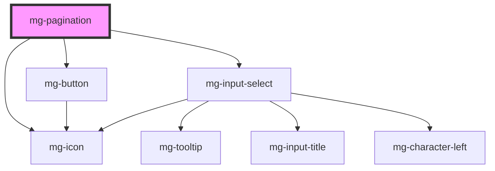

This molecule refers to the [PDA9-787](https://jira.mgdis.fr/browse/PDA9-787).

<!-- Auto Generated Below -->

## Properties

| Property      | Attribute      | Description                                                                                                 | Type     | Default                     |
| ------------- | -------------- | ----------------------------------------------------------------------------------------------------------- | -------- | --------------------------- |
| `currentPage` | `current-page` | Component current page                                                                                      | `number` | `1`                         |
| `identifier`  | `identifier`   | Identifier is used for the element ID (id is a reserved prop in Stencil.js) If not set, it will be created. | `string` | `createID('mg-pagination')` |
| `label`       | `label`        | Panignation label. Is a short description. Customize default value can be usefull to improve accessibility  | `string` | `'pagination'`              |
| `totalPages`  | `total-pages`  | Component total pages                                                                                       | `number` | `1`                         |

## Events

| Event                 | Description                            | Type                  |
| --------------------- | -------------------------------------- | --------------------- |
| `current-page-change` | Emmited event when current page change | `CustomEvent<number>` |

## Dependencies

### Depends on

- [mg-button](../../atoms/mg-button)
- [mg-icon](../../atoms/mg-icon)
- [mg-input-select](../inputs/mg-input-select)

### Graph

----------------------------------------------

*Built with [StencilJS](https://stenciljs.com/)*
