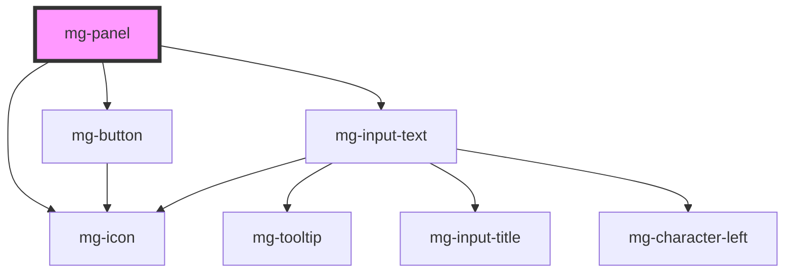

This molecule refers to the [PDA9-484](https://jira.mgdis.fr/browse/PDA9-484).

<!-- Auto Generated Below -->

## Properties

| Property                        | Attribute                           | Description                                                                                                 | Type      | Default                |
| ------------------------------- | ----------------------------------- | ----------------------------------------------------------------------------------------------------------- | --------- | ---------------------- |
| `expandToggleDisabled`          | `expand-toggle-disabled`            | Disable possibility to toggle expand                                                                        | `boolean` | `false`                |
| `expanded`                      | `expanded`                          | Panel is opened                                                                                             | `boolean` | `false`                |
| `identifier`                    | `identifier`                        | Identifier is used for the element ID (id is a reserved prop in Stencil.js) If not set, it will be created. | `string`  | `createID('mg-panel')` |
| `panelTitle` _(required)_       | `panel-title`                       | Panel title                                                                                                 | `string`  | `undefined`            |
| `panelTitlePattern`             | `panel-title-pattern`               | Panel title pattern                                                                                         | `string`  | `undefined`            |
| `panelTitlePatternErrorMessage` | `panel-title-pattern-error-message` | Panel title pattern error message                                                                           | `string`  | `undefined`            |
| `titleEditable`                 | `title-editable`                    | Panel title is editabled                                                                                    | `boolean` | `false`                |

## Events

| Event          | Description                     | Type                  |
| -------------- | ------------------------------- | --------------------- |
| `title-change` | Emmited event when title change | `CustomEvent<string>` |

## Dependencies

### Depends on

- [mg-button](../../atoms/mg-button)
- [mg-icon](../../atoms/mg-icon)
- [mg-input-text](../inputs/mg-input-text)

### Graph

----------------------------------------------

*Built with [StencilJS](https://stenciljs.com/)*
