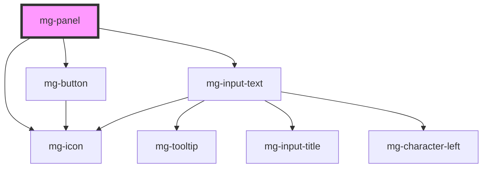

## Design

**RUX-01** : La zone gauche du header affiche le libellé de l'item, cette zone est cliquable et permet de déplier/replier le volet.
Si aucun contenu n'est disponible, le volet ne peut être déplié.
Lorsque le volet est déplié, l'icone est inversé verticalement.

**RUX-02** : La zone droite du header peut accueillir tous composants.

### Composants

### Tailles

### Espacements

### Alignements

### Styles

### Titre modifiable

#### Composants

#### Espacements

### Responsive

<!-- Auto Generated Below -->

## Properties

| Property                  | Attribute        | Description                                                                                                 | Type      | Default                |
| ------------------------- | ---------------- | ----------------------------------------------------------------------------------------------------------- | --------- | ---------------------- |
| `expanded`                | `expanded`       | Panel is opened                                                                                             | `boolean` | `false`                |
| `identifier`              | `identifier`     | Identifier is used for the element ID (id is a reserved prop in Stencil.js) If not set, it will be created. | `string`  | `createID('mg-panel')` |
| `panelTitle` _(required)_ | `panel-title`    | Panel title                                                                                                 | `string`  | `undefined`            |
| `titleEditable`           | `title-editable` | Panel title is editabled                                                                                    | `boolean` | `false`                |

## Events

| Event          | Description                     | Type                  |
| -------------- | ------------------------------- | --------------------- |
| `title-change` | Emmited event when title change | `CustomEvent<string>` |

## Dependencies

### Depends on

- [mg-button](../../atoms/mg-button)
- [mg-icon](../../atoms/mg-icon)
- [mg-input-text](../inputs/mg-input-text)

### Graph

----------------------------------------------

*Built with [StencilJS](https://stenciljs.com/)*
