## Behavior

The left zone of the header displays the item label, this zone is clickable and allows the user to unfold/fold the panel.
If no content is available, the panel cannot be unfolded.
When the panel is unfolded, the icon is vertically inverted.

The right area of the header can accommodate any component.

## Anatomy

## Specs

### Sizing

### Spacing

Slot content padding can be customized using the --mg-panel-content-padding CSS variable, default is 15px.

### Alignments

### Styles

## CSS Variables

If needed some [variables](./?path=/story/css-variables--page) are available to customize the component:

- `--mg-panel-border-radius`: Define panel border radius, default: `0.5rem`
- `--mg-panel-background`: Define panel background, default: `var(--color-info-h) var(--color-info-s) calc(var(--color-info-l) + 68%)`
- `--mg-panel-box-shadow`: Define panel box shadow, default: `var(--box-shadow)`
- `--mg-panel-content-padding`: Define panel content padding, default: `1.5rem`

<!-- Auto Generated Below -->

## Properties

| Property                   | Attribute                     | Description                                                                                                 | Type      | Default                |
| -------------------------- | ----------------------------- | ----------------------------------------------------------------------------------------------------------- | --------- | ---------------------- |
| `expandToggleDisabled`     | `expand-toggle-disabled`      | Disable possibility to toggle expand                                                                        | `boolean` | `undefined`            |
| `expanded`                 | `expanded`                    | Panel is opened                                                                                             | `boolean` | `false`                |
| `identifier`               | `identifier`                  | Identifier is used for the element ID (id is a reserved prop in Stencil.js) If not set, it will be created. | `string`  | `createID('mg-panel')` |
| `panelTitle` _(required)_  | `panel-title`                 | Panel title                                                                                                 | `string`  | `undefined`            |
| `titleEditable`            | `title-editable`              | Panel title is editabled                                                                                    | `boolean` | `false`                |
| `titlePattern`             | `title-pattern`               | Panel title pattern                                                                                         | `string`  | `undefined`            |
| `titlePatternErrorMessage` | `title-pattern-error-message` | Panel title pattern error message                                                                           | `string`  | `undefined`            |

## Events

| Event             | Description                        | Type                   |
| ----------------- | ---------------------------------- | ---------------------- |
| `expanded-change` | Emmited event when expanded change | `CustomEvent<boolean>` |
| `title-change`    | Emmited event when title change    | `CustomEvent<string>`  |

## Dependencies

### Depends on

- [mg-button](../../atoms/mg-button)
- [mg-icon](../../atoms/mg-icon)
- [mg-input-text](../inputs/mg-input-text)
- [mg-card](../../atoms/mg-card)

### Graph

```mermaid
graph TD;
  mg-panel --> mg-button
  mg-panel --> mg-icon
  mg-panel --> mg-input-text
  mg-panel --> mg-card
  mg-button --> mg-icon
  mg-input-text --> mg-icon
  mg-input-text --> mg-character-left
  mg-input-text --> mg-tooltip
  mg-input-text --> mg-input-title
  style mg-panel fill:#f9f,stroke:#333,stroke-width:4px
```

----------------------------------------------

*Built with [StencilJS](https://stenciljs.com/)*
