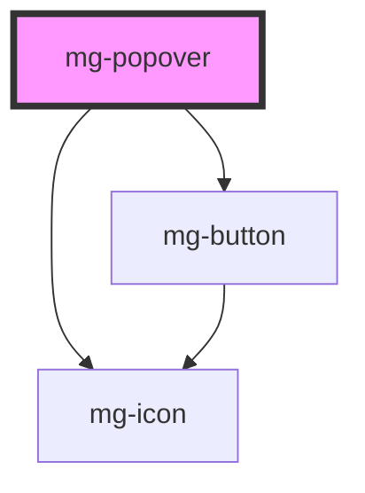

This atom refers to the [PDA9-504](https://jira.mgdis.fr/browse/PDA9-504).

<!-- Auto Generated Below -->

## Properties

| Property      | Attribute      | Description                                                                      | Type                                                                                                                                                                                                         | Default                  |
| ------------- | -------------- | -------------------------------------------------------------------------------- | ------------------------------------------------------------------------------------------------------------------------------------------------------------------------------------------------------------ | ------------------------ |
| `closeButton` | `close-button` | Define if popover has a cross button                                             | `boolean`                                                                                                                                                                                                    | `false`                  |
| `disabled`    | `disabled`     | Disable popover                                                                  | `boolean`                                                                                                                                                                                                    | `false`                  |
| `display`     | `display`      | Display popover                                                                  | `boolean`                                                                                                                                                                                                    | `false`                  |
| `identifier`  | `identifier`   | Sets an `id` attribute. Needed by the input for accessibility `aria-decribedby`. | `string`                                                                                                                                                                                                     | `createID('mg-popover')` |
| `placement`   | `placement`    | Popover placement                                                                | `"auto" \| "auto-end" \| "auto-start" \| "bottom" \| "bottom-end" \| "bottom-start" \| "left" \| "left-end" \| "left-start" \| "right" \| "right-end" \| "right-start" \| "top" \| "top-end" \| "top-start"` | `'bottom'`               |

## Dependencies

### Depends on

- [mg-button](../../atoms/mg-button)
- [mg-icon](../../atoms/mg-icon)

### Graph

----------------------------------------------

*Built with [StencilJS](https://stenciljs.com/)*
