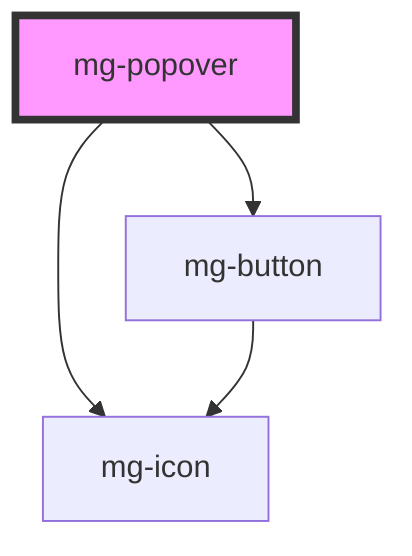

## Design 

Un popover est plus enrichi qu'une tooltip mais moins bloquant qu'une modale

**RUX-01** : la fenêtre est affichée au clic sur son déclencheur

**RUX-02** : la fenêtre est affichée à côté de son déclencheur, le plus souvent en dessous. Un triangle (en css) fait le lien entre le déclencheur et la fenêtre.

**RUX-03** : la fenêtre se ferme:

- au clic sur son déclencheur ou
- au clic en dehors de la fenêtre ou
- à la pression de la touche ECHAP
- au clic sur le bouton de fermeture en haut à droite

**RUX-04** : la taille de la fenêtre est déterminée par le contenu (prévoir une taille max pour éviter des écueils)

**RUX-05** : le titre et le bouton fermer sont optionnels

### Formes

### Fonts

### Espacements

#### Entre les bords et le contenu

#### Entre le header et le contenu

#### Entre le header et le bouton fermé

### Alignements

### Positionnements

### Couleurs

### Tailles

### Shadow

<!-- Auto Generated Below -->

## Properties

| Property      | Attribute      | Description                                                                      | Type                                                                                                                                                                                                         | Default                  |
| ------------- | -------------- | -------------------------------------------------------------------------------- | ------------------------------------------------------------------------------------------------------------------------------------------------------------------------------------------------------------ | ------------------------ |
| `closeButton` | `close-button` | Define if popover has a cross button                                             | `boolean`                                                                                                                                                                                                    | `false`                  |
| `disabled`    | `disabled`     | Disable popover                                                                  | `boolean`                                                                                                                                                                                                    | `false`                  |
| `display`     | `display`      | Display popover                                                                  | `boolean`                                                                                                                                                                                                    | `false`                  |
| `identifier`  | `identifier`   | Sets an `id` attribute. Needed by the input for accessibility `aria-decribedby`. | `string`                                                                                                                                                                                                     | `createID('mg-popover')` |
| `placement`   | `placement`    | Popover placement                                                                | `"auto" \| "auto-end" \| "auto-start" \| "bottom" \| "bottom-end" \| "bottom-start" \| "left" \| "left-end" \| "left-start" \| "right" \| "right-end" \| "right-start" \| "top" \| "top-end" \| "top-start"` | `'bottom'`               |

## Dependencies

### Depends on

- [mg-button](../../atoms/mg-button)
- [mg-icon](../../atoms/mg-icon)

### Graph

----------------------------------------------

*Built with [StencilJS](https://stenciljs.com/)*
