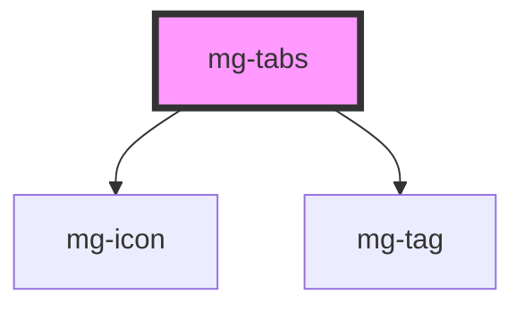

This molecule refers to the [PDA9-604](https://jira.mgdis.fr/browse/PDA9-604).

<!-- Auto Generated Below -->

## Properties

| Property             | Attribute    | Description                                                                                                 | Type                    | Default               |
| -------------------- | ------------ | ----------------------------------------------------------------------------------------------------------- | ----------------------- | --------------------- |
| `activeTab`          | `active-tab` | Active tab number default: first is 1                                                                       | `number`                | `1`                   |
| `identifier`         | `identifier` | Identifier is used for the element ID (id is a reserved prop in Stencil.js) If not set, it will be created. | `string`                | `createID('mg-tabs')` |
| `label` _(required)_ | `label`      | Tabs label. Include short tabs description. Required for accessibility                                      | `string`                | `undefined`           |
| `tabs` _(required)_  | --           | Tabs items Required                                                                                         | `TabItem[] \| string[]` | `undefined`           |

## Dependencies

### Depends on

- [mg-icon](../../atoms/mg-icon)
- [mg-tag](../../atoms/mg-tag)

### Graph

----------------------------------------------

*Built with [StencilJS](https://stenciljs.com/)*
