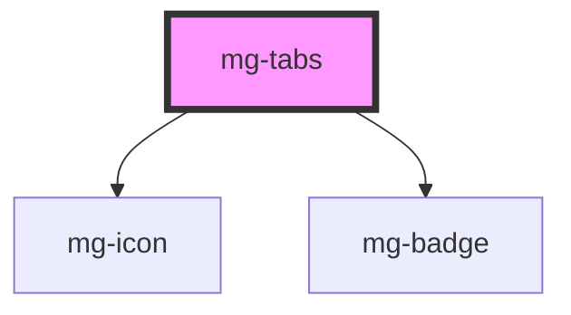

## Anatomy

## Specs

### Espacements:

- Standard : @base = 10px
- Large : @base = 18px

- si uniquement du texte, pas d'espacements supplémentaires,
- si pas de badge : pas d'espacement supplémentaire à droite
- si uniquement icone : pas d'espacement supplémentaire à droite

### Sizing

### States

### Responsive

#### Retours à la ligne (gestion actuelle)

<!-- Auto Generated Below -->

## Properties

| Property             | Attribute    | Description                                                                                                 | Type                    | Default               |
| -------------------- | ------------ | ----------------------------------------------------------------------------------------------------------- | ----------------------- | --------------------- |
| `activeTab`          | `active-tab` | Active tab number default: first is 1                                                                       | `number`                | `1`                   |
| `identifier`         | `identifier` | Identifier is used for the element ID (id is a reserved prop in Stencil.js) If not set, it will be created. | `string`                | `createID('mg-tabs')` |
| `items` _(required)_ | --           | Tabs items Required                                                                                         | `TabItem[] \| string[]` | `undefined`           |
| `label` _(required)_ | `label`      | Tabs label. Include short tabs description. Required for accessibility                                      | `string`                | `undefined`           |
| `size`               | `size`       | Define tabs size                                                                                            | `string`                | `'regular'`           |

## Events

| Event               | Description                         | Type                  |
| ------------------- | ----------------------------------- | --------------------- |
| `active-tab-change` | Emited event when active tab change | `CustomEvent<number>` |

## Dependencies

### Depends on

- [mg-icon](../../atoms/mg-icon)
- [mg-badge](../../atoms/mg-badge)

### Graph

----------------------------------------------

*Built with [StencilJS](https://stenciljs.com/)*
